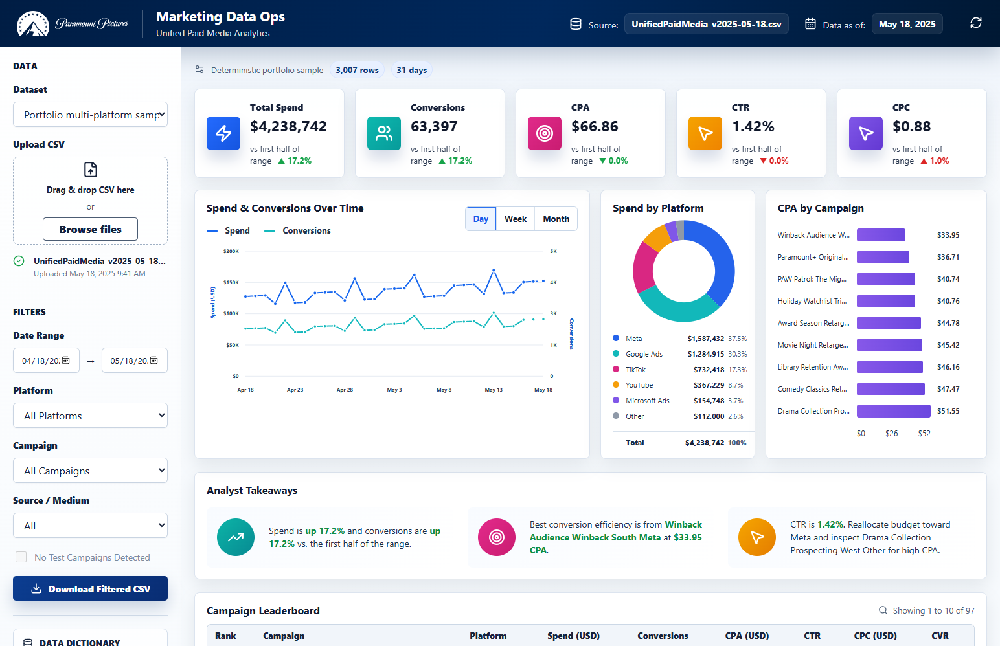

# React Marketing Ops Dashboard

A polished React/Vite paid media analytics dashboard that reads generated CSV/JSON exports. It includes two dataset modes:

- `Portfolio multi-platform sample`: deterministic demo output from the companion Airflow marketing data ops pipeline.
- `Real public Facebook ads`: anonymized public Facebook campaign performance data sourced from Kaggle and mirrored in the referenced GitHub project.

This is an independent portfolio project and is not affiliated with or endorsed by Paramount.



## What It Shows

- Paramount-style paid media command center with a dark header, left filter rail, KPI cards, daily trend chart, platform donut, CPA bars, analyst takeaways, and campaign leaderboard.
- Dataset selector that switches between the portfolio multi-platform sample and the real public Facebook ads export.
- Interactive controls for CSV upload, drag/drop import, refresh, Day/Week/Month chart aggregation when enough time buckets exist, filters, generated CSV download, pagination, rows per page, and the data dictionary disclosure.
- Data-aware filter behavior: Source / Medium options are derived from loaded rows, one-bucket Month views are hidden, and the test-campaign toggle disables when no test rows are present.
- Subtle motion polish on KPI cards, chart lines, CPA bars, hover states, drag/drop, and refresh, with reduced-motion support.
- React optimization pass with memoized dashboard sections, stable callbacks, transition-wrapped non-urgent updates, hoisted constants, and stale dataset request protection.
- Reproducible CSV/JSON data artifacts in `public/data`.
- Local SVG logo assets, not remote hotlinks.

## Run Locally

```bash
npm install
npm run build:data
npm run dev
```

The app loads data from `public/data/*.json` and keeps the matching CSV files beside them for reproducibility.

## Data

The portfolio sample is regenerated from the companion Airflow pipeline output and normalizes source, medium, campaign names, and seeded campaign-efficiency targets so the CPA leaderboard has realistic spread instead of flat demo bars.

The real dataset is `public/data/raw_real_facebook_ads.csv`, transformed by `scripts/build-data.mjs` into `public/data/real_facebook_ads_daily.csv` and `public/data/real_facebook_ads_daily.json`.

The real public CSV contains mixed row shapes where some later rows omit campaign identifiers. The transform preserves those rows as unmapped Facebook audience segments instead of inventing private campaign IDs.

The real public Facebook export spans August 2017 only, so the dashboard shows Day and Week aggregation for that dataset and hides Month because it would produce a single non-trend point.

Logo assets are local SVG files sourced from Wikimedia Commons:

- `public/paramount-mountain-logo.svg`
- `public/paramount-wordmark-logo.svg`

Dataset source: https://github.com/Zayd1602/Facebook-Ad-Campaign-Analysis

Original dataset listing: https://www.kaggle.com/datasets/madislemsalu/facebook-ad-campaign

Logo source pages:

- https://commons.wikimedia.org/wiki/File:Paramount-Mountain-Logo.svg
- https://commons.wikimedia.org/wiki/File:Paramount_Pictures_Wordmark.svg

## Verification

Validated locally on May 6, 2026:

```bash
npm run build
python .tmp/verify_interactions.py
python .tmp/verify_final_dashboard.py
```

Additional local QA used Codex Browser Use DOM/click inspection plus Playwright screenshots for the default dashboard, real-data mode, mobile rendering, CSV upload, Day/Week/Month controls, Month hiding on one-month data, Source / Medium filtering, disabled no-test-campaign state, refresh, pagination, rows-per-page, chart axis spacing, CPA panel overflow, KPI/card counts, logo assets, download link, data dictionary, leaderboard rendering, and the React optimization pass.
